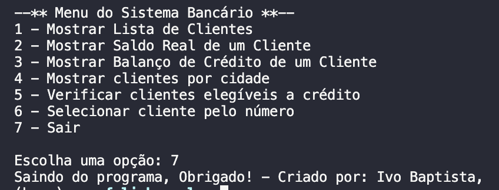
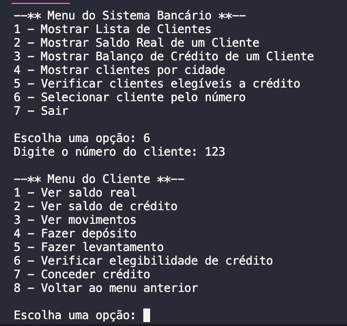

<h1 align="center">
    
</h1>

# EfolioB criado em Java e Prolog

Linguagens de Programação - EfolioB - Sistema Bancario
  
Sistema de gestão bancária, para uso interno dos gestores de conta. Utilizamos linguagem Prolog no back-end pois consideramos que a mesma é mais veloz no processamento de informação, e o front-end do sistema foi criado em modo consola feito em Java.

📌 Programa sobre # Sistema Bancario
Linguagens de Programação Java e Prolog - EfolioB - Sistema Bancario
------------------

## Para fazer a interligação entre Prolog e Java no macOS e Win, você pode usar a biblioteca JPL (Java Prolog Interface). Siga as etapas abaixo para configurar a interligação no seu ambiente:

1. Certifique-se de ter o SWI-Prolog instalado no seu sistema macOS. Você pode baixar e instalar a versão mais recente do SWI-Prolog no site oficial: https://www.swi-prolog.org/Download.html
2. Após instalar o SWI-Prolog, você precisará localizar o arquivo jpl.jar, que contém a biblioteca JPL necessária para a integração com Java. Normalmente, o arquivo jpl.jar é instalado no diretório lib dentro do diretório de instalação do SWI-Prolog.
3. Abra o Terminal e navegue até o diretório onde estão localizados os arquivos Java que fazem uso da biblioteca JPL.
4. Compile os arquivos Java junto com o jpl.jar usando o seguinte comando:

<pre>javac -cp .:/caminho/para/o/jpl.jar ArquivoJava.java</pre> Certifique-se de substituir /caminho/para/o/jpl.jar pelo caminho completo para o arquivo jpl.jar no seu sistema.

5. Após a compilação bem-sucedida, execute o programa Java usando o seguinte comando:

## Sintaxe para executar:
<pre>java -cp .:/caminho/para/o/jpl.jar ArquivoJava</pre> Novamente, substitua /caminho/para/o/jpl.jar pelo caminho completo para o arquivo jpl.jar no seu sistema.

No Visual Studio Code no MacOS compilamos sem debug com ^F5 (recomendado)

O projeto foi feito em Java e Prolog.

The project was done with Java and Prolog.

🔧 Tecnologias utilizadas:
------------------

- Java
- Prolog
- VisualStudioCode

💬 Fale comigo
------------------
[*Entre em contato comigo*](https://www.linkedin.com/in/ivo-baptista-3712144/)

